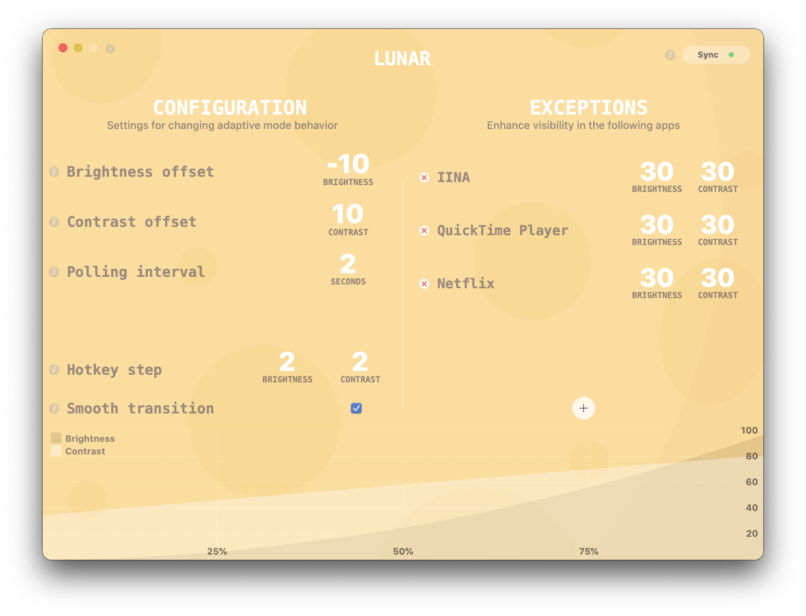
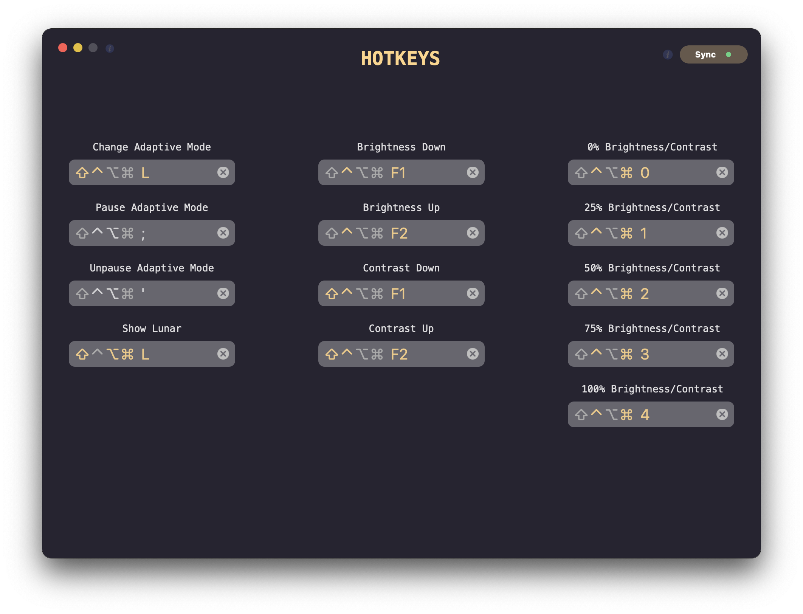

# Lunar

### Intelligent adaptive brightness for your external display

**Note: Lunar changes the actual (physical) brightness and contrast of the monitor. It doesn't use a software overlay.**

## Installation methods
- Download DMG from [Official website](https://lunar.fyi)
- `brew cask install lunar`

## Features
- **Sync-based Adaptive Brightness** (and contrast) based on the built-in light sensor of the Macbook or iMac
- **Location-based Adaptive Brightness** (and contrast) based on the sunrise/sunset times in your location
- **App Exception** list if you need more brightness for specific activities (watching movies, design work)
- individual settings per display
- **Manual controls** hotkeys for setting brightness and contrast that respect the min/max values per monitor

It doesn't interfere at all with the native adaptive brightness that macOS implements for the built-in display.

## Tested and known to work with the following types of connections
- HDMI (1.0 - 2.1)
- DisplayPort (1.0 - 2.0)
- Thunderbolt 3 (USB Type-C)
- Thunderbolt 2 (mini DisplayPort)
- VGA
- Adapters that forward DDC messages properly

## Troubleshooting
1. If Lunar freezes your system, make sure you have the latest version installed
    - Version 2.9.1 was trying to read the monitor brightness periodically through DDC and if the monitor didn't support that, the system freezed
2. If you activated the *Read Monitor Brightness Periodically* and your system freezes when using Lunar
    - Make sure Lunar is not running
    - Open Terminal.app
    - Run the following command `defaults write site.lunarapp.Lunar refreshValues 0`
    - If the above doesn't work, you can reset Lunar settings by deleting the following file:
        - `~/Library/Preferences/site.lunarapp.Lunar.plist`
    - If Lunar starts at login and freezes the computer before you can do anything, try doing the above in [Safe Mode](https://support.apple.com/en-us/HT201262)
3. If you get system lag or occasional UI freeze, this might be caused by a slow DDC response from the monitor
    - Make sure *Smooth Transition* is turned off in Lunar preferences
    - If you are using *Sync* mode, set the *Polling Interval* to a bigger value like 5 seconds to avoid making DDC requests too often

## Caveats
- Lunar *usually* doesn't work with monitors connected through USB hubs/docks/adapters **because a lot of them don't forward DDC messages properly**
- Sync mode doesn't work when the Macbook lid is closed because the light sensor is completely covered

### Contributing
Run `make dev` to prepare dev environment.
