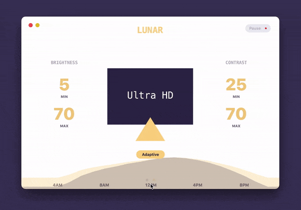

# Lunar

### Intelligent adaptive brightness for your external display

**Note: Lunar changes the actual (physical) brightness and contrast of the monitor. It doesn't use a software overlay.**

## Installation methods
- Download DMG from [Official website](https://lunar.fyi)
- `brew cask install lunar`

## Features
- **Sync-based Adaptive Brightness** (and contrast) based on the built-in light sensor of the Macbook or iMac
- **Location-based Adaptive Brightness** (and contrast) based on the sunrise/sunset times in your location
- **App Exception** list if you need more brightness for specific activities (watching movies, design work)
- individual settings per display
- **Manual controls** hotkeys for setting brightness and contrast that respect the min/max values per monitor:
    - <kbd>CTRL</kbd>+<kbd>CMD</kbd>+<kbd>0</kbd> to set brightness/contrast to **minimum**
    - <kbd>CTRL</kbd>+<kbd>CMD</kbd>+<kbd>1</kbd> for **25%** of the range between min and max
    - <kbd>CTRL</kbd>+<kbd>CMD</kbd>+<kbd>2</kbd> for **50%** of the range between min and max
    - <kbd>CTRL</kbd>+<kbd>CMD</kbd>+<kbd>3</kbd> for **75%** of the range between min and max
    - <kbd>CTRL</kbd>+<kbd>CMD</kbd>+<kbd>4</kbd> to set brightness/contrast to **maximum**
    - <kbd>CTRL</kbd>+<kbd>F1</kbd> to decrease brightness
    - <kbd>CTRL</kbd>+<kbd>F2</kbd> to increase brightness
    - <kbd>CTRL</kbd>+<kbd>SHIFT</kbd>+<kbd>F1</kbd> to decrease contrast
    - <kbd>CTRL</kbd>+<kbd>SHIFT</kbd>+<kbd>F2</kbd> to increase contrast

It doesn't interfere at all with the native adaptive brightness that macOS implements for the built-in display.

## Tested and known to work with the following types of connections
- HDMI (1.0 - 2.1)
- DisplayPort (1.0 - 2.0)
- Thunderbolt 3 (USB Type-C)
- Thunderbolt 2 (mini DisplayPort)
- VGA
- Adapters that forward DDC messages properly

## Caveats
- Lunar *usually* doesn't work with monitors connected through USB hubs/docks/adapters **because a lot of them don't forward DDC messages properly**
- Sync mode doesn't work when the Macbook lid is closed because the light sensor is completely covered

### Contributing
Run `make dev` to prepare dev environment.
